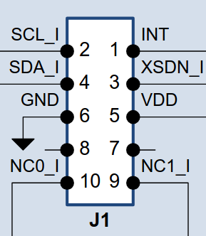
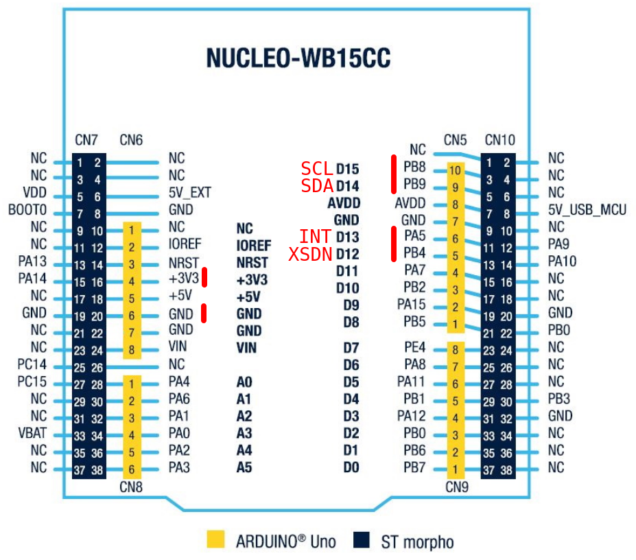

# TOF VL53L1X-SATEL

TOF VL53L1X-SATEL with STM32WB15 nucleo

## Use the API

### Copy the lib

Start by copying the ```VL53L1X_ULD_API``` in your project. You want to configure the paths in your IDE (eg. in STM32CubeIDE : ```Project > Properties``` then ```C/C++ General > Paths and Symbols```).

### Adapt to your board

The library assumes that you use the I2C1. If you use another one, you should adapt the following functions in ```VL53L1X_ULD_API/platform/platform.c``` :
```C
int _I2CWrite(uint16_t Dev, uint8_t *pdata, uint32_t count);
int _I2CRead(uint16_t Dev, uint8_t *pdata, uint32_t count);
```

### Includes

Back in your application, you will need the two following includes:
```C
#include "VL53L1X_api.h"
#include "vl53l1_error_codes.h"
```

And define the default address of the device :
```C
#define VL53L1X_DEFAULT_ADDRESS (0x29 << 1)
```

### Turn the sensor ON

Don't forget to set the XSDN pin high before everything else. For instance :
```C
HAL_GPIO_WritePin(XSDN_GPIO_Port, XSDN_Pin, GPIO_PIN_SET);
```

### Check the sensor is alive

The following functions will all have the same first parameter ```uint16_t dev```. It's the I2C address, it should probably be ```VL53L1X_DEFAULT_ADDRESS```.

You can start by getting the ID of the sensor to check if everything is in working order. It should be ```0xEACC``` :
```C
VL53L1X_ERROR VL53L1X_GetSensorId(uint16_t dev, uint16_t *id);
```

The sensor should be booted now, but you can check it anyways. ```1``` means it's booted, ```0``` means it's not :
```C
VL53L1X_ERROR VL53L1X_BootState(uint16_t dev, uint8_t *state);
```

### Initialize the sensor

Then, you need to initialize the sensor. Here we use the default parameters :
```C
VL53L1X_ERROR VL53L1X_SensorInit(uint16_t dev);
```

### Configure the sensor

The sensor's range is configured to the max (4m) by default. In this example, I limit it to 1.3m for better ambiant imunity. ```1``` is for short range, ```2``` is for long range :

```C
VL53L1X_ERROR VL53L1X_SetDistanceMode(uint16_t dev, uint16_t DistanceMode);
```

Then you set the Timing Budget (TB) and the Inter Measurement (IM). TB can take the following values (in ms) : 20, 50, 100, 200, 500. And IM must be >= TB.

```C
VL53L1X_ERROR VL53L1X_SetTimingBudgetInMs(uint16_t dev, uint16_t TimingBudgetInMs);
VL53L1X_ERROR VL53L1X_SetInterMeasurementInMs(uint16_t dev, uint32_t InterMeasurementInMs);
```

Now everything is configured, we can start the sensor :
```C
VL53L1X_ERROR VL53L1X_StartRanging(uint16_t dev);
```

### Getting the values

The ```INT``` pin should go high when a measure is done. Let's suppose it's connected to an EXTI input.

When an interrupt occur, you want to clear it :
```C
VL53L1X_ERROR VL53L1X_ClearInterrupt(uint16_t dev);
```

And then, you can finally get the distance !
```C
VL53L1X_ERROR VL53L1X_GetDistance(uint16_t dev, uint16_t *distance);
```

## Pinout



